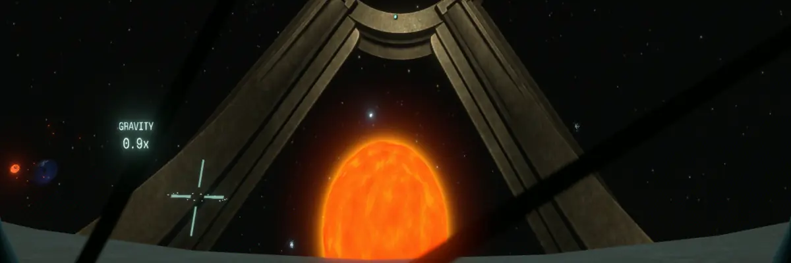

# 

# Stranger Spin Gravity

 Replaces the Stranger's gravity fields with spin gravity.

### Options
* __Stranger Spin Gravity:__ The aproximate strength of the spin gravity.  The Stranger will accelerate slowly enough to avoid injuring the player when this value changes.  Default is 1.3 to approximetly match the Stranger's vanilla gravity.
* __Stranger Faked Gravity:__ The aproximate strength of the artifical gravity fields in the Stranger.  Vanilla is around 1.25.
* __Stranger Acceleration Compenstaion:__ Whether the player accelerates with the Stranger when leaving the solar system.  The Stranger accelerates at ~0.02g, so you probably will not notice.
* __Player Ship Angular Drag:__ Whether the player's ship automatically stops spinning.  Disabling this can aide in landing on a rapidly spinning Stranger in some circumstances.
